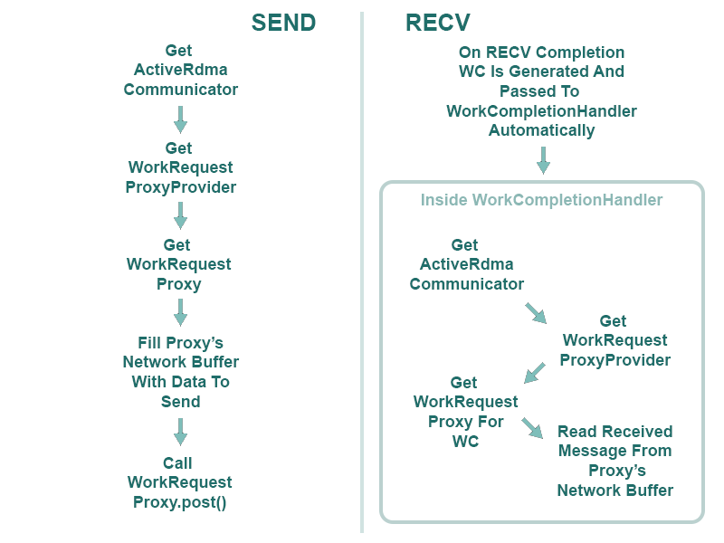
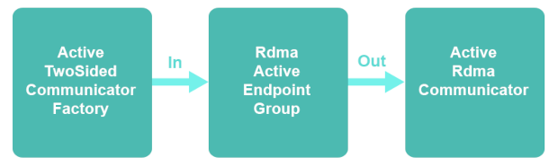

# jRCM - Java RDMA Communications Manager

### Table Of Contents
1. [What Is jRCM](#what-is-jrcm)
2. [Why Use jRCM](#why-use-jrcm)
3. [Building jRCM](#jrcm-build)
4. [jRCM Components](#jrcm-components)
5. [How To Use jRCM](#jrcm-usage)
6. [Code Examples](#jrcm-examples)
7. [Extending jRCM](#jrcm-extension)
8. [License](#jrcm-license)

### What Is jRCM 

jRCM is a Java library built for a Master's thesis
project, with title "Efficient State Machine Replication
With RDMA RPCs In Java". Its purpose is to make 
building RDMA RPCs for State Machine Replication (SMR)
in Java easier for developers, allowing flexibility as well.
In the Master's thesis, jRCM was integrated to a forked repository of
[Hazelcast IMDG](https://github.com/JohnArg/hazelcast), to
use RDMA networking instead of TCP sockets in Hazelcast's Raft 
implementation.

### Why Use jRCM 

Since RDMA requires a lot of
low level code, jRCM offers higher level constructs
that minimize the code needed 
to build RPCs for SMR with RDMA in Java.
Moreover, jRCM was created with a flexible design that
allows more than one way on building such RPCs.
jRCM is not an RPC framework though, as it
only deals with RDMA networking tasks and not with managing 
RPC requests and responses. This makes it easier to integrate
in an existing project that has its own way of managing RPC
requests and responses.
Additionally, jRCM is built on top of the
[DiSNI library](https://github.com/zrlio/disni) that enables
fast RDMA networking in Java with performance close to RDMA
networking in C.

### Building jRCM 

jRCM requires [DiSNI](https://github.com/zrlio/disni), so the
instructions on building DiSNI must be followed first.

jRCM was built as a Maven project. To use it in your projects,
download this repository and build it with Maven. This can be
done with <i>mvn install -DskipTests</i>. Then you can either
import the jRCM jar that was built in your project, or if your
project uses Maven, simply add jRCM as a dependency to your pom.xml, 
e.g :

    <dependency>
        <groupId>jarg.rdma</groupId>
        <artifactId>jrcm</artifactId>
        <version>1.0-SNAPSHOT</version>
    </dependency>

### jRCM Components 

jRCM has four main internal components that prepare any resources 
needed for 
RDMA data exchanges before starting the communications and 
retrieving those resources during communications.
These components are:

    1. A NetworkBufferManager that allocates and manages network buffers 
        for RDMA communications.
    2. An SVCManager that creates, stores and reuses SVCs 
        (Stateful Verb Calls) for performing RDMA operations efficiently.
    3. A WorkRequestProxyProvider that provides WorkRequestProxy objects. 
        The latter represent Work Requests posted to the RDMA NIC. 
        WorkRequestProxies also contain the network buffer that stores 
        data to be sent or received data.
    4. A WorkCompletionHandler interface to implement to specify what 
        will happen when a Work Request completes succesfully or with 
        errors.

The Stateful Verb Calls (SVCs) mentioned in (2) are a feature supported by
[DiSNI](https://github.com/zrlio/disni)
that allows faster execution of JNI calls when performing RDMA
operations from Java. 
SVCs are used to post Work Requests (WRs) to the RDMA NIC through
JNI calls. An SVC saves the serialized state required for such a JNI call 
and can be reused to post the same WR to the 
RDMA NIC without repeating the serialization. This makes the overheads
from JNI calls during RDMA communications minimal and has allowed
RDMA communications in Java
to perform close to RDMA communications in C.
More information about this feature can be
found 
[here](https://dominoweb.draco.res.ibm.com/reports/rz3845.pdf).
Since jRCM is built
on top of DiSNI, this feature is available in jRCM as well.

There are multiple ways to build RPCs with RDMA for
an SMR system, so
jRCM was created with flexibility in mind. 
It allows developers to choose which RDMA operations to 
use for building their RPCs. It also provides the 
ActiveRdmaCommunicator endpoint for establishing point to point 
RDMA connections, which can be passed different implementations
of the jRCM components presented above 
(<i>Strategy Design Pattern</i>).

### How To Use jRCM 

Using jRCM requires the following steps :

    1. Create instances of components 1-3 from the jRCM component list
        above. jRCM includes some default implementations but you can
        also create your own, by implementing the appropariate 
        interfaces.
    2. Implement the WorkCompletionHandler interface to specify 
        what will happen when a Work Request (WR) to the NIC completes 
        succesfully or with errors. Work Completions (WCs) for 
        completed WRs are passed to the WorkCompletionHandler and 
        developers must handle them manually, according to what their 
        application wants to do.
        A WC can be passed to the WorkRequestProxyProvider to get
        a WorkRequestProxy representing the completed WR. This can
        be used to read received data from the WorkRequestProxy's
        network buffer, for example when a RECV completes.
    3. Create RDMA communication endpoints, called 
        ActiveRdmaCommunicators, for point to point connections 
        (RC connections). ActiveRdmaCommunicators are passed the 
        implementations of jRCM's components in steps (1) and
        (2) as dependencies.
    4. Use the WorkRequestProxyProvider of an
        ActiveRdmaCommunicator to exchange RDMA messages on the
        communicator's connection. The provider provides 
        WorkRequestProxy objects, which represent Work Requests 
        to be sent to the NIC, or a completed Work Requests. Sending 
        and receiving RDMA messages with jRCM requires only the use 
        of WorkRequestProxies during RDMA communications. There is 
        no need to write code for WRs, just use the 
        WorkRequestProxyProvider to get a WorkRequestProxy for the
        type of WR that you want to post. A Work Request can be posted 
        to the RDMA NIC by simply calling the corresponding 
        WorkRequestProxy's post() method.
    5.  WorkRequestProxies are reused, so developers must ALWAYS
        remember to release them after they no longer need them, 
        by calling their releaseWorkRequest() method. The proxies
        can be released after their WR completes and the user 
        application no longer needs the network buffer.

The following image shows how to send messages with two-sided SEND/RECV
in jRCM.

        
Creating ActiveRdmaCommunicators has the same process as creating 
RdmaEndoints in DiSNI, which
can be found [here](https://github.com/zrlio/disni).
First, a <i>factory</i> class is needed to generate ActiveRdmaCommunicators.
This class must extend RdmaEndpointFactory and provide the ActiveRdmaCommunicators
with the necessary dependencies, as explained in step (3) above. 
The <i>TwoSidedDependenciesFactory</i> and <i>ActiveTwoSidedCommunicatorFactory</i>
classes are available in jRCM as an example for doing this for RDMA 
communications with only two-sided verbs. 
After a factory class has been created, an instance of this class must be
passed to an RdmaActiveEndpointGroup. The latter is the one that actually 
creates and manages the ActiveRdmaCommunicators.
The following image illustrates the process of creating ActiveRdmaCommunicators
with the ActiveTwoSidedCommunicatorFactory example class :

RDMA endpoint groups in DiSNI specify how Completion Queues will be 
assigned to RDMA endpoints. DiSNI's RdmaActiveEndpointGroups used for
ActiveRdmaCommunicators create one Completion Queue (CQ) which is shared
by ActiveRdmaCommunicators. If you want a different method of assigning 
CQs to ActiveRdmaCommunicators you can either use an RdmaPassiveEndpointGroup
or implement your own RdmaEndpointGroup. For more information on this, look
into DiSNI's documentation.

### Code Examples 

Code examples of using jRCM can be found 
[here](https://github.com/JohnArg/jrcm_examples) 

### Extending jRCM 

jRCM's components are interfaces that can be implemented in different
ways, in case the default implementations do not meet the needs of the
user application. Because of the use of interfaces, developers may choose
to implement only certain components without having to change the rest of
the code.

### License 

    Copyright [2021] [John Argyroulis]
    
    Licensed under the Apache License, Version 2.0 (the "License");
    you may not use this file except in compliance with the License.
    You may obtain a copy of the License at
    
        http://www.apache.org/licenses/LICENSE-2.0
    
    Unless required by applicable law or agreed to in writing, software
    distributed under the License is distributed on an "AS IS" BASIS,
    WITHOUT WARRANTIES OR CONDITIONS OF ANY KIND, either express or implied.
    See the License for the specific language governing permissions and
    limitations under the License.